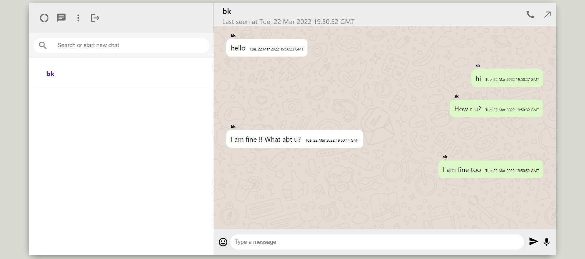

# MediaChatApp
### This is a web application built with ReactJs as Frontend library and ExpressJs as backend.
#### Here WebRTC is used to make communication between two peers. Signaling setup is handled by socket.io.

_The app is currently in development. Until now it can support messaging between two peers via RTCDataChannel, more features are coming soon..._

#### Peer 1 Browser => 
 
 
 #### Peer 2 Browser => 
 
